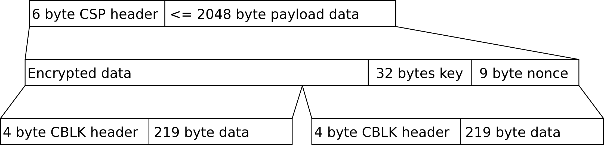

Space Inventor S-band communication link
------------------------------------------

The RF uplink and downlink relies on the CCSDS 131.0-B-4 concatenated coding. This library builds on top of the CCSDS specification to segment CSP packets into blocks suitable for the 223 bytes CCSDS frames ready for Reed Solomon encoding. Before segmentation, the library is optionally able to apply a 256 bit encryption using a pre configured shared key.

CBLK protocol
~~~~~~~~~~~~~~~

The Space Inventor protocol implemented to be used on top of CCSDS 131.0-B-4 is known as CBLK.

.. class:: centered

*Packing of CSP packet into CCSDS frames*

The protocol is available as an open source library, to be used as a CSP interface, implemented in a CSH APM or similar application.

Implementation requirements
~~~~~~~~~~~~~~~~~~~~~~~~~~~~~~

The CBLK interface needs a provider specific implementation, forwarding the CCSDS frames to and from the provider or modem in use. The interface requirements are defined in csp_if_cblk.h and lists the following:

.. list-table:: 
    :widths: 15 30
    :header-rows: 1

    * - Function
      - Purpose

    * - ``cblk_tx_buffer_get``
      - Function to provide a buffer for holding a CCSDS frame in transmit direction

    * - ``cblk_tx_send``
      - Function to forward buffer to the modem

    * - ``csp_if_cblk_rx``
      - This function shall be called when a CCSDS frame is received by the modem

    * - ``csp_if_cblk_init``
      - This function shall be called to initialize the interface
